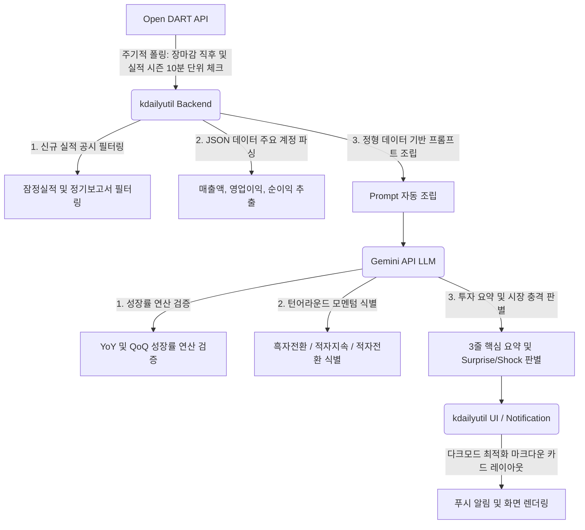

# 🚀 한국 상장기업 실적 공시 AI 자동 요약 모듈 (kdailyutil 확장)

본 문서는 `kdailyutil` 시스템의 기능을 확장하여, 대한민국 상장기업의 실적 공시(잠정 실적 및 분기/사업보고서)를 **Open DART API**를 통해 실시간 수집하고, **Gemini API(LLM)**를 활용해 3줄 요약 및 어닝 서프라이즈 여부를 판별하여 사용자에게 푸시/로그 알림을 제공하는 모듈의 설계 및 구현 가이드입니다.

---

## 🛠️ 1. 시스템 아키텍처 (Anti-gravity 스타일)

복잡한 인프라 없이 **Lightweight 백엔드 파이프라인**으로 동작하며, 주기적인 Polling 방식을 채택하여 비용과 리소스를 최소화합니다.



### 📋 상세 데이터 흐름
1. **[Open DART API]**
   - 주기적 폴링: 장마감 직후 및 실적 시즌 10분 단위 체크
2. **[kdailyutil Backend]**
   - 1. 신규 실적 공시(잠정실적 및 정기보고서) 필터링
   - 2. JSON 데이터 내 주요 계정(매출액, 영업이익, 순이익) 파싱
   - 3. 정형 데이터 기반 AI 프롬프트(Prompt) 자동 조립
3. **[Gemini API (LLM)]**
   - 1. 전년 동기 대비(YoY) 및 전분기 대비(QoQ) 성장률 연산 검증
   - 2. 흑자전환 / 적자지속 / 적자전환 등 턴어라운드 모멘텀 식별
   - 3. 투자자 관점의 3줄 핵심 요약 및 시장 충격(Surprise/Shock) 판별
4. **[kdailyutil UI / Notification]**
   - 다크모드 컴포넌트에 최적화된 마크다운 카드 레이아웃 형태로 푸시 및 화면 렌더링

---

## 🔑 2. 사전 준비 사항 (Prerequisites)

1. **Open DART API 인증키 발급**
   - 금융감독원 Open DART 회원가입 후 개발자용 API Key 발급 (일일 10,000회 무료 호출 가능).
2. **Google AI Studio (Gemini) API Key 발급**
   - 분당 요청 제한(RPM) 내에서 무료 혹은 매우 저렴한 비용으로 텍스트 분석 가능.

---

## 📡 3. 데이터 수집 설계 (Open DART API 규격)

개인 개발자 계정으로 일일 10,000회 무료 호출이 가능한 Open DART API의 다음 엔드포인트를 조회하여 데이터를 수집합니다.

1. **공시 검색 API (`/api/list.json`)**
   - **주요 파라미터**:
     - `crtfc_key`: 발급받은 DART API Key
     - `corp_code`: 대상 기업 고유번호 (예: 켄코아에어로스페이스 등)
     - `bgn_de`: 조회 시작일 (YYYYMMDD) - *과거 일자 조회를 위해 동적 변수화*
     - `end_de`: 조회 종료일 (YYYYMMDD)
     - `pblntf_ty`: `I` (공시유형: 투자판단관련주요경영사항 - 잠정실적 및 실적공시 포함)
   - **역할**: 관심 종목 또는 전체 시장에서 실적 관련 공시가 새로 등록되었는지 고유번호(`corp_code`) 등을 기준으로 모니터링 및 지정 기간 내 공시 목록을 필터링합니다.

2. **단일회사 주요계정 API (`/api/fnlttSinglAcntAll.json`)**
   - **주요 파라미터**:
     - `crtfc_key`: 발급받은 DART API Key
     - `corp_code`: 대상 기업 고유번호
     - `bsns_year`: 사업연도 (YYYY)
     - `reprt_code`: 보고서 코드 (1분기보고서: `11013`, 반기보고서: `11012`, 3분기보고서: `11014`, 사업보고서: `11011`)
   - **역할**: 매출액, 영업이익, 당기순이익의 당기 금액과 전기 및 전전기 금액 수치들을 수집합니다.

---

## 💬 4. 프롬프트 엔지니어링 지침 (AI 분석 가이드라인)

AI에 전달할 프롬프트는 컨텍스트 비용을 줄이기 위해 원문 전체 HTML 텍스트를 배제하고, 오직 수집된 핵심 수치 데이터만 JSON 형식으로 가공하여 프롬프트에 제공합니다. (앱 소스코드 내부에 내장되는 비공개 시스템 프롬프트 영역입니다.)

### 📝 표준 프롬프트 구조 예시
```text
너는 대한민국 코스닥 및 코스피 시장을 담당하는 전문 금융 분석가이자 퀀트(Quant)야.
아래 제공된 기업의 최근 실적 데이터(JSON)를 기반으로 개인 투자자가 내일 아침 개장 직후 직관적이고 빠르게 파악할 수 있도록 투자 관점의 요약을 작성해줘.

[실적 정형 데이터]
{파싱된 매출액, 영업이익, 당기순이익 데이터}

[수행 지침]
1. 정량적 수치 비교: 전년 동기 대비(YoY) 성장률을 백분율(%)과 절대 금액으로 명확히 산출해 줄 것.
2. 턴어라운드 감지: 영업이익이 적자에서 흑자로 전환(Turn-around)되었는지 여부를 최우선으로 분석하고 판단해 줄 것.
3. 출력 형식 제한: 반드시 마크다운(Markdown) 포맷으로 출력하되, 불필요한 서론이나 결론 문장은 제외하고 아래 형식을 엄격히 지켜서 답변할 것:

### 📊 실적 요약
* **매출액 변동**: [전년비 증가/감소율 및 금액]
* **영업이익 변동**: [전년비 증가/감소율 및 금액, 흑자전환 여부 필수 기재]

### 💡 3줄 투자 관점
1. [이번 실적의 가장 긍정적인 요인]
2. [주의 깊게 봐야 할 리스크 또는 비용 요인]
3. [종합 평가: 어닝 서프라이즈 / 인라인 (예상부합) / 어닝 쇼크 중 택1]
```

---

## 💻 5. 핵심 소스코드 예시 (Python/Flask 기반 참조)

`kdailyutil` 내부의 백엔드/유틸리티 매커니즘에 이식할 수 있는 핵심 파이썬 로직 예시입니다. (실제 안드로이드 앱 구현 시에는 코틀린 라이브러리 `OkHttp` 및 `google-generativeai` Android SDK로 변환하여 코드 내부에 내장됩니다.)

```python
import requests
import os
from google import genai

# 환경 변수 설정
DART_API_KEY = os.getenv("DART_API_KEY")
GEMINI_API_KEY = os.getenv("GEMINI_API_KEY")

def get_recent_disclosures(corp_code, bgn_de):
    """
    1. Open DART로부터 특정 기업의 최근 공시 목록을 가져옵니다.
    """
    url = "https://opendart.fss.or.kr/api/list.json"
    params = {
        'crtfc_key': DART_API_KEY,
        'corp_code': corp_code,  # 고유번호 (예: 켄코아에어로스페이스 등)
        'bgn_de': bgn_de,        # 조회 시작일 (YYYYMMDD)
        'pblntf_ty': 'I'         # 공시유형: 투자판단관련주요경영사항 (실적공시 포함)
    }
    response = requests.get(url, params=params)
    return response.json().get('list', [])

def analyze_earnings_with_gemini(raw_financial_data):
    """
    2. 파싱된 재무 데이터를 Gemini LLM에 전달하여 안티그래비티 스타일로 초고속 요약합니다.
    """
    client = genai.Client(api_key=GEMINI_API_KEY)
    
    # 템플릿 프롬프트 조립 (토큰 세이브 및 출력 규격 제한)
    prompt = f"""
    너는 대한민국 코스닥/코스피 시장 전문 퀀트 분석가야.
    아래 제공된 JSON 형태의 기업 실적 데이터를 보고, 개인 투자자를 위한 핵심 요약을 작성해줘.
    
    [실적 데이터]
    {raw_financial_data}
    
    [출력 요구사항]
    - 반드시 한국어로 작성할 것.
    - 아래 형식을 엄격히 지켜서 답변할 것 (마크다운 포맷):
    
    ### 📊 실적 요약
    * **매출액 변동**: [전년비 증가/감소율 및 금액]
    * **영업이익 변동**: [전년비 증가/감소율 및 금액, 흑자전환 여부 필수 기재]
    
    ### 💡 3줄 투자 관점
    1. [이번 실적의 가장 긍정적인 요인]
    2. [주의 깊게 봐야 할 리스크 또는 비용 요인]
    3. [종합 평가: 어닝 서프라이즈 / 인라인 (예상부합) / 어닝 쇼크 중 택1]
    """
    
    response = client.models.generate_content(
        model='gemini-2.5-flash',
        contents=prompt
    )
    return response.text
```

---

## 🎯 6. 프롬프트 엔지니어링 및 데이터 가공 팁 (Anti-gravity 철학)

* **극도의 토큰 다이어트**
  공시 문서의 raw HTML 전체를 Gemini에 던지면 API 비용이 폭증하고 컨텍스트 제한에 걸립니다. Open DART API에서 제공하는 `다회사 주요계정 조회(fnlttSinglAcntAll.json)` API 등을 사용하여 **매출액, 영업이익, 당기순이익 수치 6~8개만 쏙 뽑아 JSON 스트링으로 가공 후 프롬프트에 바인딩**합니다. 이렇게 하면 건당 비용이 거의 0원에 가깝습니다.
* **비동기 큐 / 스케줄러 처리**
  장 마감 직후인 오후 3시 30분 ~ 6시 사이에 실적 공시가 쏟아집니다. 이 타임라인에는 `kdailyutil` 내부의 `APScheduler`를 구동하여 10분 주기로 `get_recent_disclosures`를 폴링하도록 스케줄링합니다.

---

## 🎨 7. UI/UX 반영 계획 (kdailyutil 인터페이스)

* **실시간 푸시 알림 제목**
  `[kdailyutil] 🚀 켄코아에어로스페이스 1분기 흑자전환 성공! 어닝 서프라이즈 감지`
* **상세 보기 화면**
  Gemini가 리턴한 Markdown 텍스트를 그대로 렌더링하고, 가시성을 위해 어닝 서프라이즈(빨간색 배지), 어닝 쇼크(파란색 배지) 형태로 테마에 맞추어 깔끔하게 노출합니다.

---

## 📈 8. 기대 효과 및 UI 반영 요소

* **실시간 성과 판별**
  수백 페이지에 달하는 분기보고서 주석을 읽을 필요 없이, 공시 후 5초 이내에 핵심 재무 상태 변화를 파악할 수 있습니다.
* **체감 온도 극복**
  전체 지수(코스닥 등)가 지지부진하더라도 실적이 찍히거나 흑자전환에 성공한 알짜 중소기업(예: 우주항공, 반도체 소부장 등)을 선별해 알림으로써, 시장 소외 국면에서 주도주 순환매에 빠르게 동참할 수 있는 계기를 제공합니다.
* **MTS형 시각화**
  `kdailyutil` 앱의 다크모드 테마와 조화를 이루도록 흑자전환/서프라이즈는 강조 컬러 배지로, 쇼크/적자지속은 대비되는 컬러 배지로 라벨링하여 가시성을 극대화합니다.

---

## 📱 9. 메뉴 위치 및 UI 통합 계획 (kdailyutil 내 배치)

### ❓ "뉴스 탭의 증시" vs "독립된 증시 대시보드"의 차이점
* **뉴스 탭의 증시 (기존)**: 단순한 **뉴스 검색어 수집기**입니다. 등록한 키워드(예: 종목명)가 매칭된 인터넷 기사 목록만 크롤링하여 보여주며, 실시간 주가 변동이나 실적 지표 분석 정보는 제공하지 않습니다.
* **독립된 증시 대시보드 (신규 제안)**: Yahoo Finance API의 실시간 시세/차트 데이터와 본 Open DART API + Gemini 실적 분석 엔진이 유기적으로 통합된 **종합 금융 데이터 판넬**입니다.

### 🧭 하단 네비게이션 메뉴 설계안

하단 네비게이션 바에 독립된 **[증시] 탭**을 추가하기 위한 두 가지 설계안입니다.

#### 💡 [추천] 방안 A: 5대 하단 탭 체제 유지 및 쉐도잉 메뉴 흡수
* **배경**: 모바일 하단 탭 바가 6개 이상이 되면 공간이 매우 협소해져 사용성이 나빠집니다.
* **조정안**: 
  1. `뉴스 쉐도잉 (DrivingShadowing)` 메뉴는 단독 탭 대신 **[뉴스] 탭 상세 화면** 및 **오디오 캡처** 내의 링크 버튼으로 진입하도록 설계를 흡수(통합)합니다. (실제로 이미 뉴스 카드 우하단에 말하기 연습 아이콘이 배치되어 있어 통합이 매우 자연스럽습니다.)
  2. 그 빈자리에 **[증시]** 탭을 독립적으로 배치합니다.
* **하단 메뉴 구성 (5개)**:
  * `[뉴스] - [증시 (신규)] - [오디오 캡처] - [배움터] - [설정]`

#### 방안 B: 6대 하단 탭으로 확장 및 UI 최적화
* **배경**: 기존 메뉴를 유지하면서 증시 탭만 추가합니다.
* **조정안**:
  1. 하단 `NavigationBarItem`에 `alwaysShowLabel = false` 설정을 주어, 선택된 탭의 이름만 글자로 나오게 하고 선택되지 않은 탭은 아이콘만 띄우도록 설계하여 가로 협소 문제를 해소합니다.
* **하단 메뉴 구성 (6개)**:
  * `[뉴스] - [증시 (신규)] - [뉴스 쉐도잉] - [오디오 캡처] - [배움터] - [설정]`

---

## 📡 10. 수집 대상 및 범위 설계 (종목 키워딩 기준)

전체 상장사(2,500+)의 모든 공시를 돌리는 것은 비용과 기기 성능 문제로 불가능하므로 아래와 같이 **투트랙(Two-track)**으로 수집 범위를 제한합니다.

1. **관심 종목 대상 실시간 자동 모니터링 (백그라운드)**
   * 사용자가 설정란([MorningBriefingSettingsScreen](../app/src/main/java/com/kitwlshcom/kdailyutil/ui/screens/MorningBriefingSettingsScreen.kt))에서 등록한 **'관심 증시/종목' 키워드 리스트**를 기준으로 삼습니다.
   * 백그라운드 스케줄러(WorkManager)가 돌며 이 관심 기업들의 고유번호(`corp_code`)에 대해 새로운 실적 공시가 떴는지만 필터링하여 감지합니다.
   * 감지 시 즉시 백그라운드에서 Gemini 요약을 생성하고 푸시 알림으로 보고합니다.
2. **당일 전체 실적 공시 목록 중 선택 요약 (프론트엔드)**
   * DART API를 통해 당일 한국 주식시장 전체에 뜬 실적 관련 공시 목록(텍스트 제목과 기업명만 구성된 가벼운 리스트)을 `[증시]` 탭의 한쪽 영역에 나열해 줍니다.
   * 사용자는 목록을 훑어보다가 관심이 가는 공시 항목을 **직접 터치(클릭)**합니다.
   * 터치된 순간에만 로딩 스피너와 함께 해당 공시의 상세 재무 데이터를 파싱하고, Gemini LLM을 호출해 실시간 요약 카드(바텀시트 또는 팝업)로 띄워줍니다.
   * **기대효과**: 전체 시장의 흐름을 보면서도 API 비용과 데이터 호출 트래픽을 극적으로 절감할 수 있습니다.

---

## 📅 11. 과거 공시 데이터 분석 기능 추가 기획 (신규)

당일 공시뿐만 아니라 과거의 공시 데이터 흐름을 추적하여 더 심도 있는 기업의 성장 추이를 시각화합니다.

1. **기간별 공시 검색 필터 제공**
   * `[증시]` 탭의 공시 리스트 상단에 **조회 기간 필터**를 구성합니다.
   * `[당일] - [최근 3일] - [1주일] - [1개월] - [직접 선택(달력)]` 형태의 필터링 칩(Filter Chip) UI를 연동합니다.
   * 이를 위해 DART API 호출 시 `bgn_de`(조회 시작일)와 `end_de`(조회 종료일) 파라미터를 동적으로 변경하여 과거 날짜의 데이터를 원활하게 긁어옵니다.
2. **기업별 최근 4분기 실적 추이 요약 카드 제공**
   * 특정 기업을 관심 종목 화면에서 상세 터치했을 때, 해당 기업의 **최근 4분기 실적 요약 내역**을 히스토리 리스트로 펼쳐줍니다.
   * 사용자가 이전에 클릭하여 한 번 요약해 두었던 과거 분기 데이터는 **로컬 캐시 DB**에 반영되어 있으므로 API 재요청 없이 즉각 로드됩니다.
   * 캐시된 4분기 데이터를 기반으로 Gemini에게 *"해당 기업의 최근 4개 분기 실적 추이를 요약하고, 성장세 또는 둔화 우려 여부를 종합 분석해줘"*라는 **"누적 실적 트렌드 분석 보고서"** 기능을 파생하여 제공할 수 있습니다.

---

## 🗓️ 12. 공시 예정(캘린더) 및 사전 전망 리포트 기능 추가 기획 (신규)

한국 시장은 실적 발표 예정일을 DART에 사전 의무 등록하지 않는 경우가 많으나, 증권사 및 금융 포털의 실적 발표 캘린더 정보를 연동하여 선제적인 투자 정보를 제공합니다.

1. **실적 발표 일정 캘린더 (Jsoup 크롤링)**
   * DART API는 사후 공시만 제공하므로, 앱의 기존 `Jsoup` 라이브러리를 활용해 **네이버 페이 증권(실적발표 캘린더)** 또는 주요 포털 사이트의 실적 발표 일정표 페이지를 백그라운드 크롤링합니다.
   * 이번 주 또는 오늘 실적 발표가 예정된 주요 기업들의 목록을 캘린더(달력/타임라인) 뷰로 보기 쉽게 보여줍니다.
2. **AI 실적 발표 사전 전망 리포트 (Consensus Pre-Report)**
   * 공시 예정 종목 중 분석하고 싶은 종목을 클릭하면, Gemini AI가 **최근 1주일간의 증권가 전망 기사 + 이전 분기 실적 데이터 + 시장 컨센서스(예상 매출/영업이익)** 정보를 수집 및 조립하여 발표 전 사전 리포트를 생성합니다.
   * **리포트 예시 구성**:
     * **시장 컨센서스 예상치**: 매출액 `X`억원 / 영업이익 `Y`억원 (전년 동기 대비 `Z%` 변동 예상)
     * **AI 분석 핵심 관전 포인트**: 발표 시 주목해야 할 2~3가지 핵심 사업 지표 (예: 반도체 부문의 적자 폭 축소 여부, 신규 플랫폼 광고 단가 반등 여부 등)

---

## 🔑 13. API 인증키 운영 계획

* **Gemini API Key**: 기존 정책과 동일하게 사용자가 직접 [Google AI Studio](https://aistudio.google.com/app/apikey)에서 발급받아 설정 화면에 등록한 키를 사용합니다. (서버 비용 부담 전가 목적)
* **Open DART API Key**: 
  * 일일 호출 제한이 10,000회로 매우 넉넉하므로, 개발자의 공용 API 키를 빌드 타임 환경 변수(`local.properties`)로 기본 탑재해 배포합니다.
  * 다만, 공용 키가 한도에 도달할 경우를 대비하여 설정 화면 하단에 **"개인 Open DART API 키 사용 (선택)"** 옵션을 추가해 사용자가 개인 키를 넣어 우회할 수 있도록 구현합니다.

---

## ⚠️ 14. 향후 추가적인 기술 검토 포인트

1. **DART 기업 고유번호 (`corp_code`) 맵핑**:
   * DART API는 조회 시 종목코드나 회사명이 아닌 8자리 고유 ID(`corp_code`)를 필수로 요구합니다.
   * DART에서 배포하는 고유번호 맵핑 파일(`CORPCODE.xml`)을 최초 앱 설치 시 백그라운드에서 다운로드 후 내부 DB(Room)에 파싱·저장하여 사용자가 회사명을 검색할 때 고유번호로 자동 전환되도록 유틸리티 클래스를 설계해야 합니다.
2. **로컬 AI 분석 데이터 캐싱**:
   * 한 번 Gemini로 분석이 완료된 공시 본문은 로컬 데이터베이스에 해당 공시 접수번호(`rcept_no`)를 키(Key)값으로 삼아 저장해야 합니다. 이미 분석한 공시를 다시 열 때는 Gemini API를 재호출하지 않고 로컬 캐시에서 즉시 불러와 응답 속도를 0.1초로 단축시킵니다.
3. **지능적 백그라운드 주기 (Doze 모드 대응)**:
   * 배터리 절약을 위해 안드로이드의 `WorkManager`를 활용하며, 장 마감 이후(15:30 ~ 18:00) 및 실적 시즌에만 백그라운드 체크 주기를 촘촘하게(예: 10분~30분) 가져가고, 심야 시간이나 장 중에는 주기를 크게 넓히거나 작동을 멈추는 동적 스케줄링이 필요합니다.

---

## 🛡️ 15. 전체 구현 단계의 종합 체크리스트 & 예외 방지 대책 (Holistic Checklist)

개발을 안전하고 빈틈없이 진행하기 위해 전체 아키텍처 및 구현 상에서 반드시 점검해야 할 예외 사항과 대비책입니다.

### 1. 데이터 파싱 예외 처리 (DART 재무 계정 명칭 비표준화 대응)
* **문제점**: DART의 단일회사 주요계정 API는 기업에 따라 또는 업종(제조업 vs 금융업 등)에 따라 재무제표 계정명이 다르게 반환됩니다.
  * *예: 매출액을 "매출수익", "영업수익", "매출" 등으로 기재하거나, 영업이익을 "영업이익(손실)" 등으로 표현.*
* **대비책**: 파싱 코드 내에 **동의어 맵핑 테이블(Synonym Mapping List)**을 구현하여 유연하게 매칭합니다.
  * `매출액 Key` = `["매출액", "매출", "영업수익", "매출수익"]`
  * `영업이익 Key` = `["영업이익", "영업이익(손실)", "영업손실"]`
  * `당기순이익 Key` = `["당기순이익", "당기순이익(손실)", "반기순이익", "분기순이익"]`

### 2. Gemini API 트래픽 초과 대응 (Rate Limits - 429 Too Many Requests)
* **문제점**: 실적 발표 시즌에 사용자가 여러 기업의 공시 상세보기를 연달아 터치하거나, 백그라운드 작업이 여러 건 몰릴 경우 분당 요청 수(RPM)를 초과하여 API 에러가 발생합니다.
* **대비책**:
  * **프론트엔드**: 로딩 스너 애니메이션 노출 시 뒤로가기 및 중복 클릭을 방지하는 차단 레이어 구현.
  * **백엔드/로직**: API 호출 실패 시 지수 백오프(Exponential Backoff)를 적용한 자동 재시도 로직 구현 및 사용자에게 *"서버 요청이 혼잡합니다. 잠시 후 다시 시도해 주세요."*라는 친절한 Toast/다이얼로그 출력.

### 3. API 키 노출 방지 및 사용자 데이터 암호화 (Security & Privacy)
* **문제점**: 사용자의 개별 Gemini API Key 또는 개별 DART Key가 로컬 기기 스토리지에 평문(Plaintext)으로 저장될 경우, 기기가 루팅되거나 보안 취약점이 뚫리면 키가 유출될 위험이 있습니다.
* **대비책**: 안드로이드 `Jetpack Security` 라이브러리의 `EncryptedSharedPreferences` 또는 안드로이드 시스템 `Keystore` 암호화를 연동하여, 키값을 로컬 스토리지에 암호화하여 영속 저장합니다.

### 4. 로컬 저장소 스토리지 고갈 방지 (Cache Lifecycle 관리)
* **문제점**: 과거 공시 데이터 및 AI 요약본 캐시를 로컬 데이터베이스에 기한 없이 무한정 축적하면 앱 용량이 급증하고 DB 조회 속도가 저하될 수 있습니다.
* **대비책**: **캐시 만료 수명(TTL - Time To Live)** 정책을 적용하여, 로컬 캐시 DB 저장 날짜를 기준으로 **3개월(90일) 이상 경과한 과거 공시 데이터는 백그라운드(WorkManager 등)에서 자동으로 삭제(Auto-purge)**하도록 설계합니다.

### 5. 웹 포털 스크래핑 IP 차단 우회 (Web Scraping Rate Limit)
* **문제점**: 실적 발표 캘린더 수집을 위해 네이버 페이 증권 등을 너무 잦은 주기로 Jsoup 크롤링할 경우, 포털 웹서버 측에서 비정상 트래픽으로 오인하여 앱 사용자의 IP를 일시적/영구적 차단(Blocking)할 수 있습니다.
* **대비책**: 캘린더 일정 크롤링 주기를 **1일 1회(또는 12시간 1회)**로 극도로 넓게 잡고, 긁어온 데이터는 로컬 DB에 보관하여 하루 동안 재활용(Read-only cache)하는 효율적인 조회 정책을 고수합니다.
